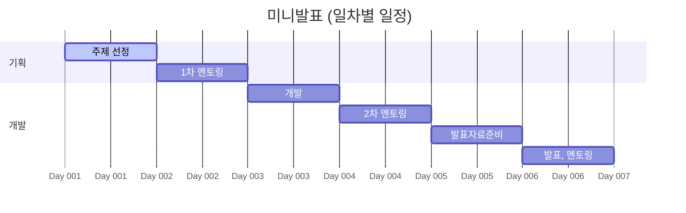
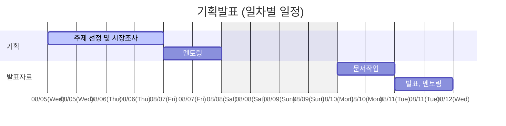
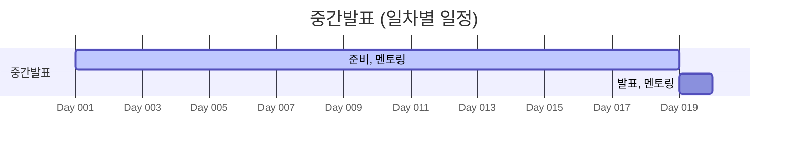

## 미니프로젝트

```mermaid
gantt
    title 미니발표 (일차별 일정)
    dateFormat  YYYY-MM-DD
    
    %% 축을 일수(Day 01, Day 05...) 형태로 표시하고 5일 단위로 눈금을 끕니다
    axisFormat Day %j
    tickInterval 5d

    section 기획
    주제 선정                : active, a1, 2026-01-01, 1d
    1차 멘토링               : a2, after a1, 1d

    section 개발
    개발                    : b1, after a2, 1d
    2차 멘토링               : b2, after b1, 1d
    발표자료준비              : b3, after b2, 1d
    발표, 멘토링             : b4, after b3, 1d

```

---

## 최종프로젝트

```mermaid
gantt
    title 기획발표 (일차별 일정)
    dateFormat  YYYY-MM-DD
    
    %% 축을 일수(Day 01, Day 05...) 형태로 표시하고 5일 단위로 눈금을 끕니다
    %% axisFormat Day %j
    axisFormat %m/%d(%a)
    tickInterval 0.5day
    excludes weekends

    section 기획
    주제 선정 및 시장조사       : active, a1, 2026-08-05, 2d
    멘토링                  : a2, after a1, 1d

    section 발표자료
    문서작업                 : b1, after a2, 1d
    발표, 멘토링              : b2, after b1, 1d

```

---

```mermaid
gantt
    title 중간발표 (일차별 일정)
    dateFormat  YYYY-MM-DD
    
    %% 축을 일수(Day 01, Day 05...) 형태로 표시하고 5일 단위로 눈금을 끕니다
    axisFormat Day %j
    tickInterval 5d

    section 중간발표
    준비, 멘토링             : active, a1, 2026-01-01, 18d
    발표, 멘토링             : a2, after a1, 1d

```

---

```mermaid
gantt
    title 최종발표 (일차별 일정)
    dateFormat  YYYY-MM-DD
    
    %% 축을 일수(Day 01, Day 05...) 형태로 표시하고 5일 단위로 눈금을 끕니다
    axisFormat Day %j
    tickInterval 5d

    section 최종발표
    개발, 멘토링             : active, a1, 2026-01-01, 16d
    발표, 수료               : a2, after a1, 1d

```
