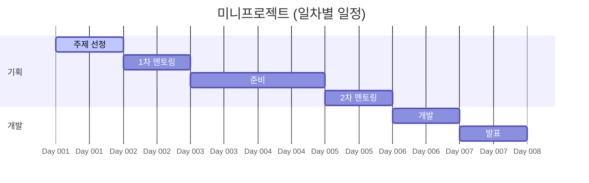
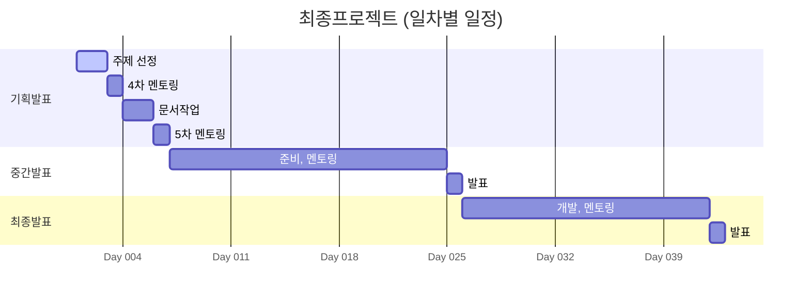

```mermaid
gantt
    title 미니프로젝트 (일차별 일정)
    dateFormat  YYYY-MM-DD
    
    %% 축을 일수(Day 01, Day 05...) 형태로 표시하고 5일 단위로 눈금을 끕니다
    axisFormat Day %j
    tickInterval 5d

    section 기획
    주제 선정                : active, a1, 2026-01-01, 1d
    1차 멘토링               : a2, after a1, 1d
    준비                    : a3, after a2, 2d
    2차 멘토링               : a4, after a3, 1d

    section 개발
    개발                   : b1, after a4, 1d
    발표                   : b2, after b1, 1d

```

---

```mermaid
gantt
    title 최종프로젝트 (일차별 일정)
    dateFormat  YYYY-MM-DD
    
    %% 축을 일수(Day 01, Day 05...) 형태로 표시하고 5일 단위로 눈금을 끕니다
    axisFormat Day %j
    tickInterval 5d

    section 기획발표
    주제 선정                : active, a1, 2026-01-01, 2d
    4차 멘토링               : a2, after a1, 1d
    문서작업                 : a3, after a2, 2d
    5차 멘토링               : a4, after a3, 1d

    section 중간발표
    준비, 멘토링             : b1, after a4, 18d
    발표                   : b2, after b1, 1d

    section 최종발표
    개발, 멘토링             : c1, after b2, 16d
    발표                   : c2, after c1, 1d

```
