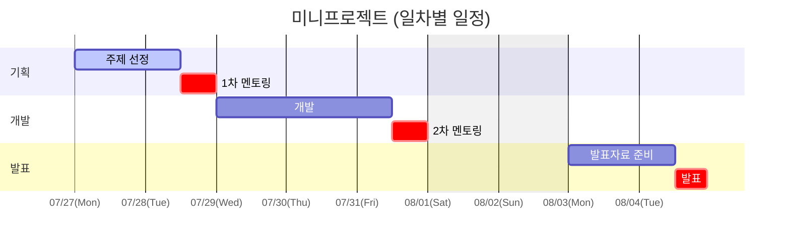
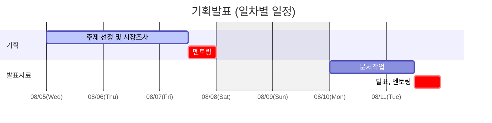
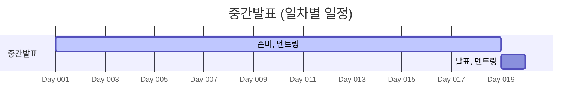

## 미니프로젝트

```mermaid
gantt
    title 미니프로젝트 (일차별 일정)
    dateFormat  YYYY-MM-DD HH:mm

    %% 반나절 단위는 dateFormat에 시간을 넣어 표현합니다 (오전 09:00~13:00 / 오후 13:00~18:00)
    axisFormat %m/%d(%a)
    tickInterval 1day
    excludes weekends

    section 기획
    주제 선정                : active, a1, 2026-07-27 00:00, 2026-07-28 12:00
    1차 멘토링               : crit, a2, 2026-07-28 12:00, 2026-07-29 00:00

    section 개발
    개발                    : b1, 2026-07-29 00:00, 2026-07-31 12:00
    2차 멘토링               : crit, b2, 2026-07-31 12:00, 2026-08-01 00:00

    section 발표
    발표자료 준비             : c1, 2026-08-03 00:00, 2026-08-04 12:00
    발표                    : crit, c2, 2026-08-04 12:00, 2026-08-04 23:00

```

---

## 최종프로젝트

```mermaid
gantt
    title 기획발표 (일차별 일정)
    dateFormat  YYYY-MM-DD HH:mm
    
    %% 반나절 단위는 dateFormat에 시간을 넣어 표현합니다 (오전 09:00~13:00 / 오후 13:00~18:00)
    axisFormat %m/%d(%a)
    tickInterval 1day
    excludes weekends

    section 기획
    주제 선정 및 시장조사       : active, a1, 2026-08-05 00:00, 2026-08-07 12:00
    멘토링                  : crit, a2, 2026-08-07 12:00, 2026-08-08 00:00

    section 발표자료
    문서작업                 : b1, 2026-08-10 00:00, 2026-08-11 12:00
    발표, 멘토링              : crit, b2, 2026-08-11 12:00, 2026-08-11 23:00

```

---

```mermaid
gantt
    title 중간발표 (일차별 일정)
    dateFormat  YYYY-MM-DD
    
    %% 축을 일수(Day 01, Day 05...) 형태로 표시하고 5일 단위로 눈금을 끕니다
    axisFormat Day %j
    tickInterval 5d

    section 중간발표
    준비, 멘토링             : active, a1, 2026-01-01, 18d
    발표, 멘토링             : a2, after a1, 1d

```

---

```mermaid
gantt
    title 최종발표 (일차별 일정)
    dateFormat  YYYY-MM-DD
    
    %% 축을 일수(Day 01, Day 05...) 형태로 표시하고 5일 단위로 눈금을 끕니다
    axisFormat Day %j
    tickInterval 5d

    section 최종발표
    개발, 멘토링             : active, a1, 2026-01-01, 16d
    발표, 수료               : a2, after a1, 1d

```
