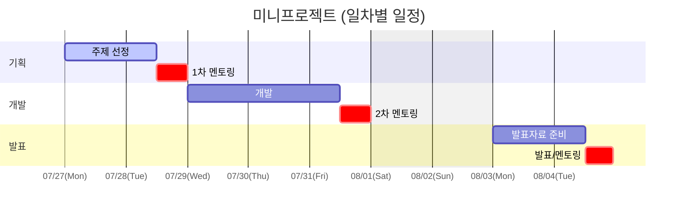
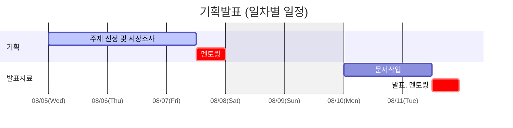
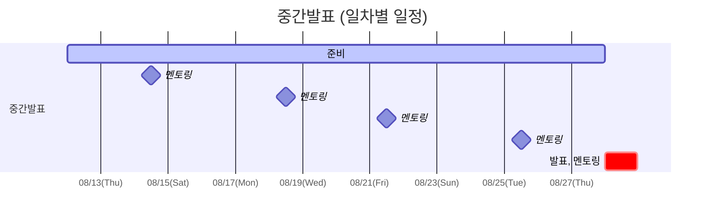
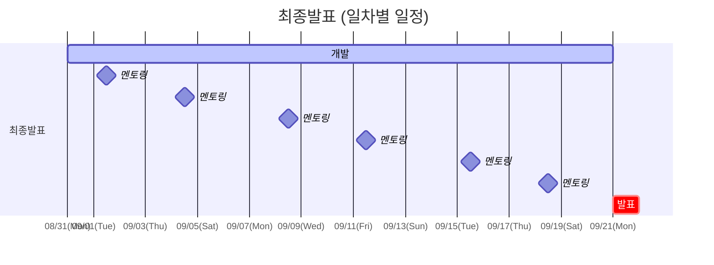

## 미니프로젝트

```mermaid
gantt
    title 미니프로젝트 (일차별 일정)
    dateFormat  YYYY-MM-DD HH:mm

    %% 반나절 단위는 dateFormat에 시간을 넣어 표현합니다 (오전 09:00~13:00 / 오후 13:00~18:00)
    axisFormat %m/%d(%a)
    tickInterval 1day
    excludes weekends

    section 기획
    주제 선정                : active, a1, 2026-07-27 00:00, 2026-07-28 12:00
    1차 멘토링               : crit, a2, 2026-07-28 12:00, 2026-07-29 00:00

    section 개발
    개발                    : b1, 2026-07-29 00:00, 2026-07-31 12:00
    2차 멘토링               : crit, b2, 2026-07-31 12:00, 2026-08-01 00:00

    section 발표
    발표자료 준비             : c1, 2026-08-03 00:00, 2026-08-04 12:00
    발표/멘토링                    : crit, c2, 2026-08-04 12:00, 2026-08-04 23:00

```

---

## 최종프로젝트

```mermaid
gantt
    title 기획발표 (일차별 일정)
    dateFormat  YYYY-MM-DD HH:mm
    
    %% 반나절 단위는 dateFormat에 시간을 넣어 표현합니다 (오전 09:00~13:00 / 오후 13:00~18:00)
    axisFormat %m/%d(%a)
    tickInterval 1day
    excludes weekends

    section 기획
    주제 선정 및 시장조사       : active, a1, 2026-08-05 00:00, 2026-08-07 12:00
    멘토링                  : crit, a2, 2026-08-07 12:00, 2026-08-08 00:00

    section 발표자료
    문서작업                 : b1, 2026-08-10 00:00, 2026-08-11 12:00
    발표, 멘토링              : crit, b2, 2026-08-11 12:00, 2026-08-11 23:00

```

---

```mermaid
gantt
    title 중간발표 (일차별 일정)
    dateFormat  YYYY-MM-DD HH:mm

    %% 반나절 단위는 dateFormat에 시간을 넣어 표현합니다 (전반부 00:00~12:00 / 후반부 12:00~24:00)
    axisFormat %m/%d(%a)
    tickInterval 2day

    section 중간발표
    준비                    : active, a1, 2026-08-12 00:00, 2026-08-28 00:00
    멘토링                 : milestone, m1, 2026-08-14 12:00, 0d
    멘토링                 : milestone, m2, 2026-08-18 12:00, 0d
    멘토링                 : milestone, m3, 2026-08-21 12:00, 0d
    멘토링                 : milestone, m4, 2026-08-25 12:00, 0d
    발표, 멘토링             : crit, a2, 2026-08-28 00:00, 2026-08-28 23:00

```

---

```mermaid
gantt
    title 최종발표 (일차별 일정)
    dateFormat  YYYY-MM-DD HH:mm

    %% 반나절 단위는 dateFormat에 시간을 넣어 표현합니다 (전반부 00:00~12:00 / 후반부 12:00~24:00)
    axisFormat %m/%d(%a)
    tickInterval 2day

    section 최종발표
    개발                    : active, a1, 2026-08-31 00:00, 2026-09-21 00:00
    멘토링                  : milestone, m1, 2026-09-01 12:00, 0d
    멘토링                  : milestone, m2, 2026-09-04 12:00, 0d
    멘토링                  : milestone, m3, 2026-09-08 12:00, 0d
    멘토링                  : milestone, m4, 2026-09-11 12:00, 0d
    멘토링                  : milestone, m5, 2026-09-15 12:00, 0d
    멘토링                  : milestone, m6, 2026-09-18 12:00, 0d
    발표                     : crit, a2, 2026-09-21 00:00, 1d

```
